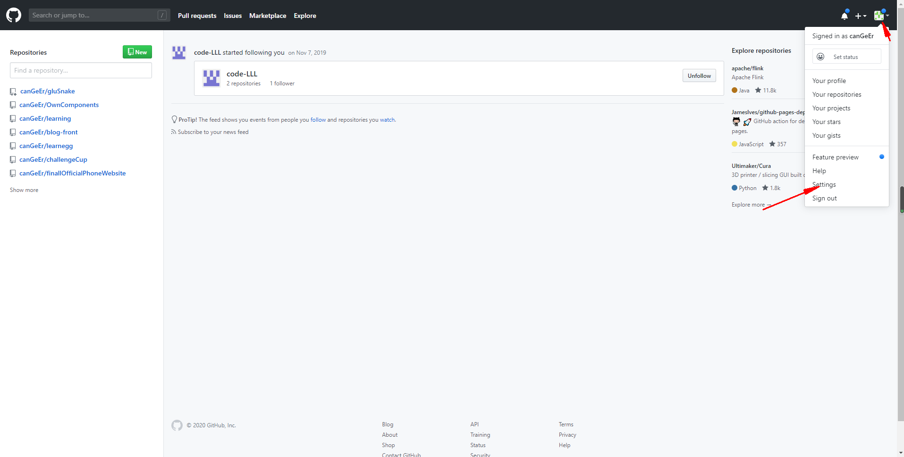

# git

## 安装
5
## 创建SSH

> **.ssh** 文件夹 在 C:\Users\Administrator(默认)  

```bush
//在C盘下 git-bush

$ cd ~/.ssh

//在终端输入

$ ssh-keygen -t rsa -C "youremail@example.com” //邮箱

/*然后一路回车用默认值也没关系，完成后在.ssh目录下就会有两个文件：id_rsa和id_rsa.pub，分别是私钥和公钥。接下来把密钥添加进ssh-agent高速缓存中，*/
//在终端输入：

$ ssh-add ~/.ssh/id_rsa
(
    如果报错 Could not open a connection to your authentication agent.
    $ ssh-agent bash // + 测试成功
    $ ssh-add ~/.ssh/id_rsa
)
ssh-add -k ~/.ssh/id_rsa
```

## github密钥创建
登入github账号

选择**SSH adn GPG keys**   并 New SSH key


## git clone git@....
注意它让你选写什么就写什么不要少(要求严格)


## 结束
.ssh 文件会多出一个文件表示链接
