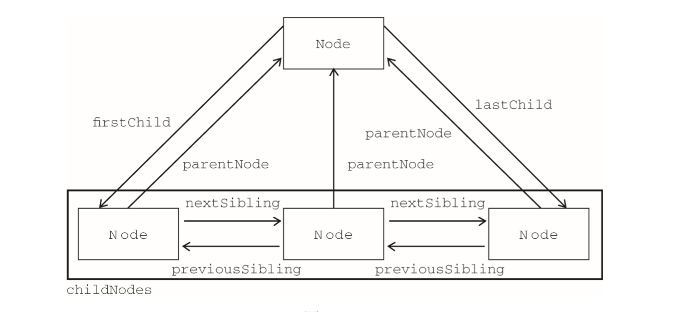

# DOM的那些事
DOM是文档对象模型

## 常见的节点类型
1 => ELEMENT  
2 => ATTRIBUTE  
3 => TEXT   
8 => COMMENT  
9 => DOCUMENT 

## 常用的节点属性(Node)
1. nodeType     节点类型
2. nodeName     节点名称    // 一般只有element元素才有
3. nodeValue    节点值      // 一般只有文本节点才有 
4. childNodes   字节点      // NodeList 对象
5. parentNode   父节点
6. previousSibling 
7. nextSibling 
8. firstChild   //注意这个节点修饰,虽然看起来有点像element,但是还是需要注意区别
9. lastChild 
10. ownerDocument         //指向文档对象

## NodeList对象
NodeList 是有生命、有呼吸的对象，而不是在我们第一次访问它们 的某个瞬间拍摄下来的一张快照

访问方法:
1. 方括号
2. item()

## 原型链关系
div => HTMLDivElement => HTMLElement => Element => Node
document => HTMLDocument => Document => Node

## document的常用属性
1. doctype  => 文档声明
2. documentElement => html元素
3. body => body 元素, head => head 元素
4. URL => 地址栏信息
5. ：write()、writeln()、open()和 close()。

## Element类型
1. 其具有tagName属性可以访问标签名
2. 基本属性的获取,设置,移除 getAttribute, setAttribute, removeAttributes
3. attributes 属性 。attributes 属性中包含一个 NamedNodeMap,元素的每一个特性都由一个 Attr 节 点表示，每个节点都保存在 NamedNodeMap 对象中   
(1) getNamedItem(name)  
(2) removeNamedItem(name)   
(3) setNamedItem(node)  
(4) item(pos)
