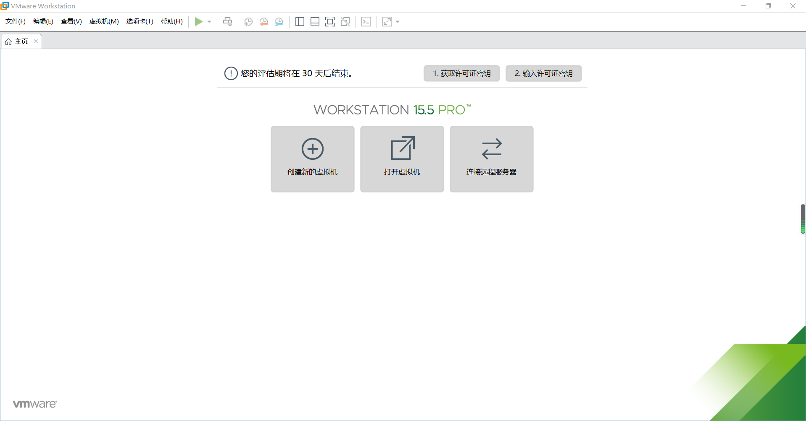
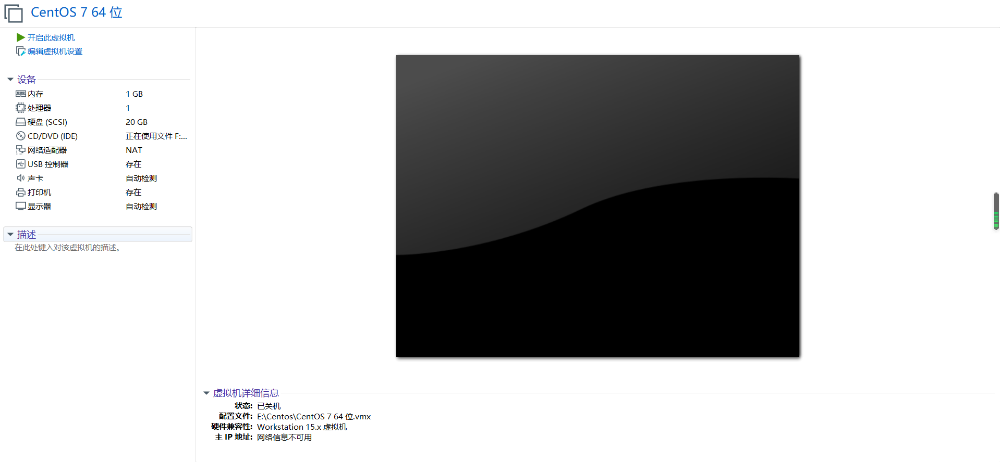
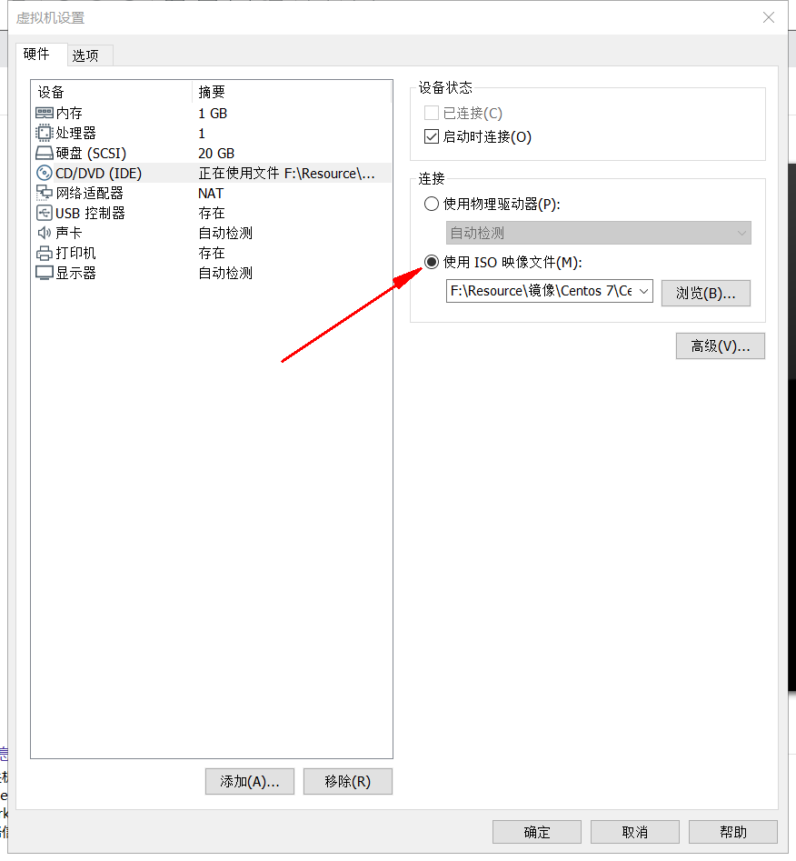
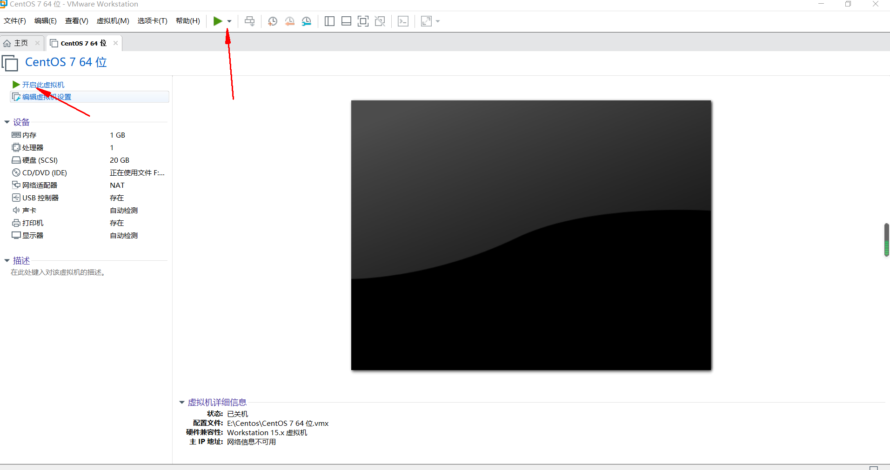

# Centos 7 安装演示

## 下载VMware软件
VMWare是一个“虚拟机”软件,它使你可以在一台机器上同时运行二个或更多WIN2000 / WINNT / WIN9X / DOS / LINUX系统。
与“多启动”系统相比，VMWare采用了完全不同的概念。多启动系统在一个时刻只能运行一个系统，在系统切换时需要重新启动机器。VMWare是真正“同时”运行，多个操作系统在主系统的平台上，就象Word / Excel那种标准Windows应用程序那样切换。

## 创建一个虚拟机
安装好后VMware启动界面  ：

1. 点击创建虚拟机, 选择典型(推荐) 确认
2. 选择稍后安装操作系统，创建虚拟机包含一个空白的硬盘
3. 选择 linux
4. 选择自定义安装位置，比较大，不推荐C盘安装
5. 20G不用调, 创建完成

## 下载Centos 7 isos
>下载地址: http://mirrors.aliyun.com/centos/ (aliyun镜像)进入选择7 / isos / x86_64 (同时支持32和64)

## 载入isos到虚拟机

## 开启虚拟机

## 进入bios界面
开启虚拟机后进入开机动画，注意此时你还未进入改虚拟机，
需要点击虚拟机显示内部，进入（进入之后看不见鼠标），此时的操作才对
虚拟机有效，快速按F2键进入bios界面

## 关盘安装isos载入硬盘
>默认是硬盘启动，但是Centos还在isos光盘上，因此需要转换成CD安装,但是修改之后每次启动都以光盘开始重新安装，所有第一次安装之后要改回硬盘安装

## 自定义分区
1. /root 200 至少
2. /home 2000 至少
3. /wamp 1000
4. / 剩余 (跟)

## 先选择基础服务版安装
> 下次启动记得改为硬盘启动