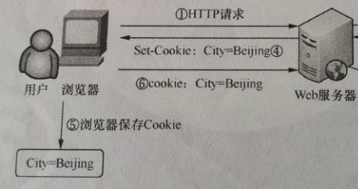
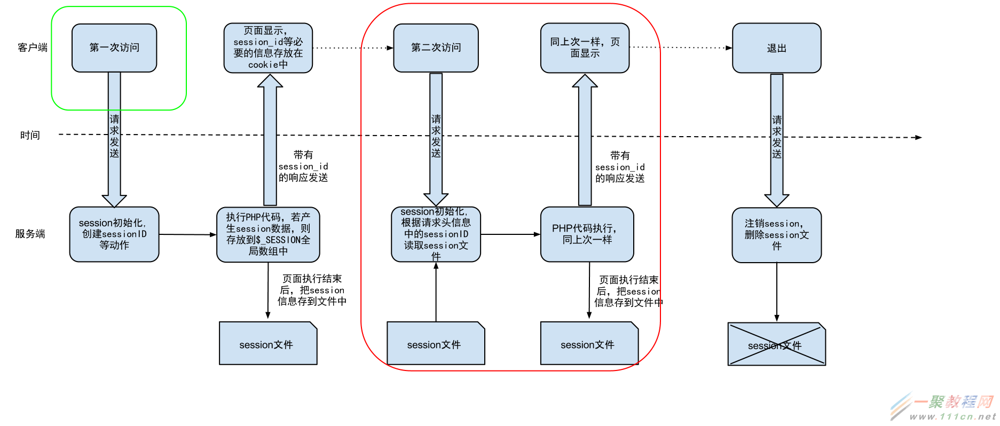

# Cookie 和 Session 基本概念

## 什么是无状态
无状态是指Web浏览器与Web服务器之间不需要建立持久的连接，这意味着当一个客户端向服务器端发出请求，然后Web服务器返回响应（Response），连接就被关闭了，在服务器端不保留连接的有关信息。也就是说，HTTP请求只能由客户端发起，而服务器不能主动向客户端发送数据。

## Cookie
> Cookie 是一些数据, 存储于你电脑上的文本文件中 ---菜鸟教程

一种http会话机制,为了解决HTTP协议本身是无状态的( "如何记录客户端的用户信息":), 因此，在第一次向服务器发送请求没有cookie(假设是没有任何操作记录), 服务器通过在响应报文的Set-Cookie设置对应的cookie值，以便客户端下次发送请求带上cookie，服务器通过识别cookie实现继续会话(交互)

### Cookie 是存储在客户端
这一点很容易理解，在浏览器里，cookie相当于缓存一样,在前台可以**document.cookie**查看cookie,在开发者工具的application可以看到浏览器当前域名下的cookie完备的信息

### Cookie 后端可操作 Set-Cookie
1. Cookie既然是会话机制，那么和服务器交流肯定要传给后端，所以每次再向后端接口请求的请求报文是会带上Cookie告诉后端信息，以便维持会话状态。
2. Cookie在访问服务器时，服务器可能会在响应消息中增加Set-Cookie字段，将信息以|Cookie形式发送给浏览器，一旦浏览器接受到服务器发送的Cookie消息，那么会将其保存到浏览器的缓冲区，以便下次会话交换信息。
3. 看一张图   

### Cookie的几种登入方式
1. 把登录信息如账号、密码等保存在Cookie中，并控制Cookie的有效期，下次访问时再验证Cookie中的登录信息即可。这是一种比较危险的选择，一般不把密码等重要信息保存到Cookie中
2. 一种方案是把密码加密后保存到Cookie中，下次访问时解密并与数据库比较（可能伪造cookie登入)，还可以把登录的时间戳保存到Cookie与数据库中，到时只验证用户名与登录时间戳就可以了。
3. 只在登录时查询一次数据库，以后访问验证登录信息时不再查询数据库。自定义密钥Key，
把账号和Key按照一定的规则加密后，连同账号一块保存到Cookie中。下次访问时只需要判断账号的加密规则是否正确即可(通过传来的user类字段和Key再次加密比对Cookie)。（可能伪造cookie登入)

## Session
> Session利用上了Cookie   

1. Session是一种服务器端技术，它的生命周期从用户访问页面开始，直到与网站的连接结束。
当服务端调用Session服务（在一些书上说启动Session，而事实上只有当代码级别的调用Session才会启用Session），web服务器在运行期间为访问该服务器的浏览器创建一个独享的Session文件。在创建Session文件时，每个Session都具有一个唯一的会话ID，用于标识不同的ID（一般是一段长串），且会话ID分别存储在服务端和客户端(Set-Cookie写回Cookie 这一系列从调用session时自动完成，也许就是因此称为服务器端技术把)。

2. 看下图以PHP为例

3. 当浏览器第二次访问服务器时，Session服务自动根据SessionID识别用户，读取对应的session文件，此时程序操作的session时独立的（每个浏览器访问，服务器开辟一个独立的进程/线程/异步处理）

4. 