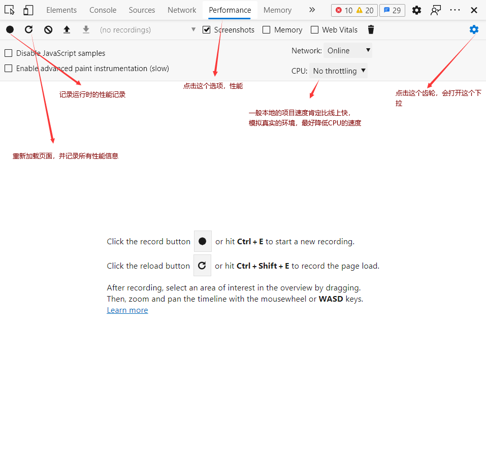
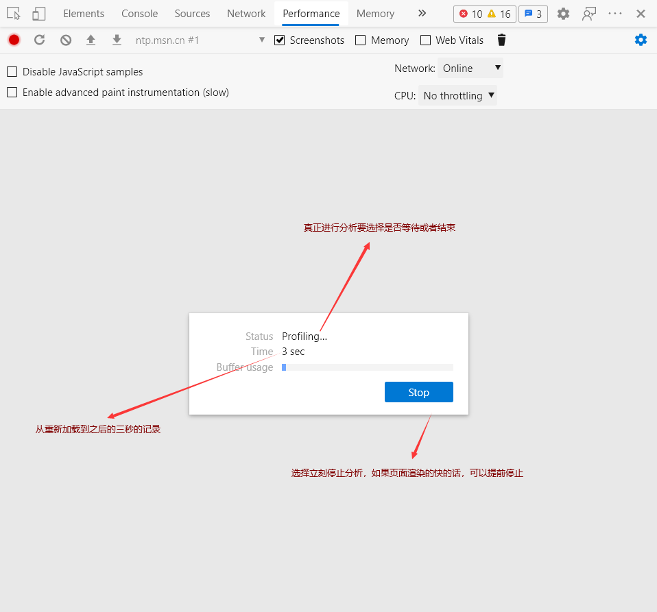
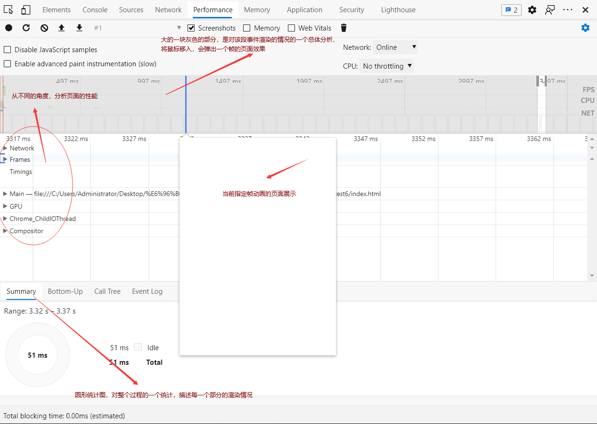
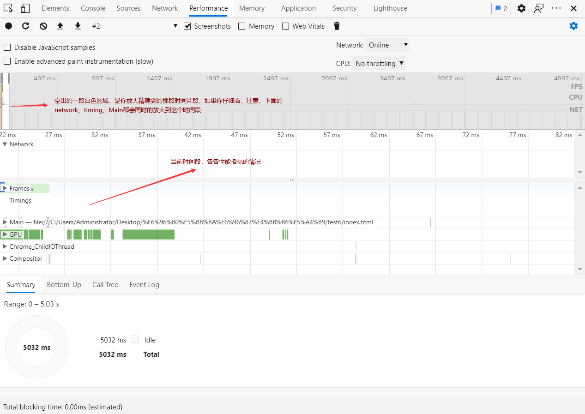
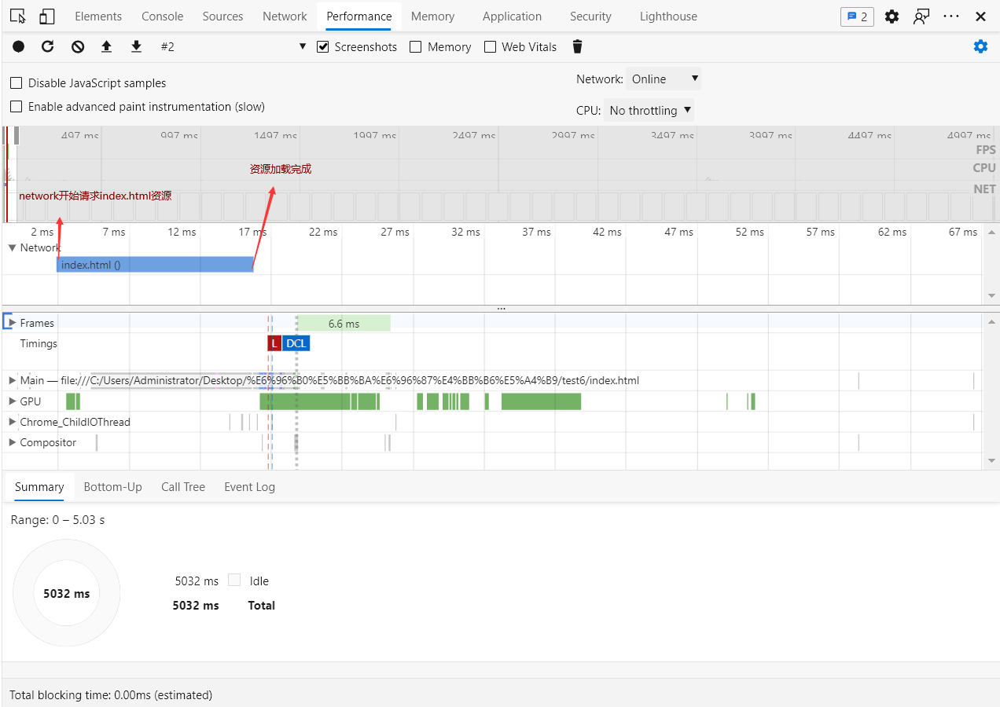
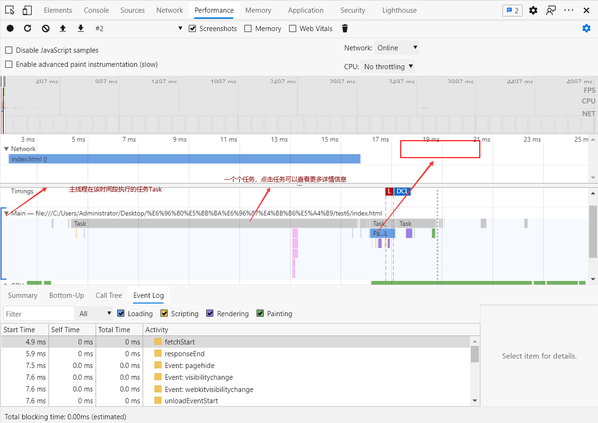
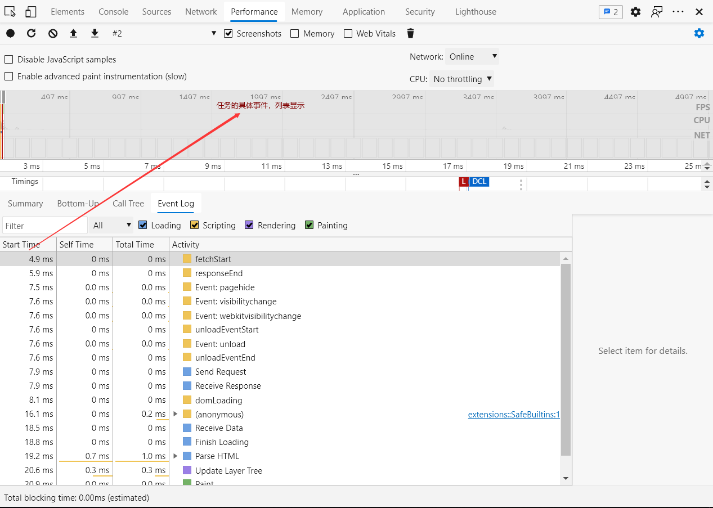

# 02 如何调试和测验
> 即使说太多，如果只是一味的理论，你可能又看了很多篇文章，但是不知道谁对谁错，最好的办法就是自己去验证。
JavaScript怎么执行，执行顺序，什么时候渲染，什么时候停止渲染，这些都有必要去验证，去深究。

## 一、一些Chrome调试技巧
推荐一本书（作者已经将它免费了）    
[掘金小册 - 你不知道的 Chrome 调试技巧](https://juejin.cn/book/6844733783166418958)   
**Chrome DevTools：** 浏览器调试器

尤为推荐[通用篇 - 使用 Command](https://juejin.cn/book/6844733783166418958/section/6844733783204167688)是关于调试器指令去工作。为什么需要呢？调试器面板实在有限，好多功能不好展示，就留下一个指令执行器。

## 二、Chrome的performance性能面板

### **(1) 进入**

### **(2) 重新加载测试**

### **(3) 分析性能结构**
面板图介绍

### **(4) 对时间刻度的描述**
如果你注意到上面的中央部分的话，你一定会觉得有点乱，所有我并不推荐你，一上手就去分析一个比较复杂的页面（就像我上面截的图一样，即使没有什么内容，依然各种各样的横线和竖线）

接下来，注意，说一下那些竖线是什么？不知道你是否注意带灰色地方的刻度，那是描述那个时间点，各种性能情况的度量。但是你可能发现，由于太密集，更本无法分析，你只要将鼠标上在中央地带的任何你想要看的时间刻度的大致范围内，再按下w键，图就会放大，更加精细到那一段时间。

### **(4) network分析**

### **(5) Main分析 渲染进程的主线程分析**
还是要解释一下，什么是"主线程"    

Parse HTML、CSS和执行JavaScript共同的一个线程（是所有渲染进程的子线程的入口main）

### **(6) 列表显示事件发生情况**

