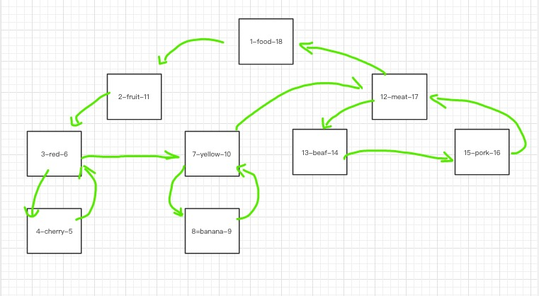

# 说明
> 首先，思考清楚当前数据是否需要树形的数据结构，而不是像 “评论”，用两个表来代替树形

树形结构即使设计出来，也需要考虑性能和是否能够解决问题：
- 问题一：获取某节点的所有子节点（包括孙子节点），拉取所有子节点数据，然后在内存拼接
- 问题二：获取某个节点的直属子节点
- 问题三：获取某个节点的父亲节点
- 问题四：删除、插入节点

假设存在树形结构如下：
```bush
1 food
  2 fruit
    3 red
      4 cherry
    5 yellow
      6 banana
  7 meat
    8 beef
    9 pork
```

## Adjacency List
> 每一条记录存parent_id，没有 parent_id 为 根节点

| id          | name        | parent_id   | 
| ----------- | ----------- | ----------- |
| 1           | food        |             |
| 2           | fruit       | 1           |
| 3           | red         | 2           |
| 4           | cherry      | 3           |
| 5           | yellow      | 2           |
| 6           | banana      | 5           |
| 7           | meat        | 1           |
| 8           | beef        | 7           |
| 9           | pork        | 7           |

**完成任务**：
- 解决**问题二**：根据节点id，查询parent_id === id
- 解决**问题一**：递归执行SQL，根据 每层的 id 找所有子节点 parent_id 为 id
- 解决**问题三**：通过parent_id查找
- 解决**问题四**：
  - 删除：只能一层一层的删除所有有关联的数据，当然如果你只是删除当前数据的话，数据表里就有冗余数据
  - 插入：最简单，写入parent_id 就行

**注意事项**：
- 优点：
  - 数据库层面简单实现
- 缺点：
  - 查询困难连带删除困难，虽然可以进行简易删除但是导致冗余数据
  - 查找数据需要递归执行sql，除非获取根目录所有子节点7

## Path Enumerations
> 每一条记录存path，没有 path 为 根节点

| id          | name        | path        | 
| ----------- | ----------- | ----------- |
| 1           | food        |             |
| 2           | fruit       | /1          |
| 3           | red         | /1/2        |
| 4           | cherry      | /1/2/3      |
| 5           | yellow      | /1/2        |
| 6           | banana      | /1/2/5      |
| 7           | meat        | /1          |
| 8           | beef        | /1/7        |
| 9           | pork        | /1/7        |

**完成任务**：
- 解决**问题二**：根据节点id和path，只需要查 子节点的 path = path + \`/${id}\`
- 解决**问题一**： 只需要在二的基础上，加上path的模糊匹配

- 解决**问题三**：把当前节点的path截取尾部的数字
- 解决**问题四**：
  - 删除：和查询所有子节点一样，直接模糊匹配删除所有子节点
  - 插入：最简单，写入 path 就行

**注意事项**：
- 优点：
  - 算是对 **Adjacency List**  的增强，弥补了 parent_id 需要层级递归查找所有的子节点
- 缺点：
  - path不够规范，和代码程序实现耦合高
  - path的长度有限，迟早会被占用完，所以也并不是无限层级


## Nested Sets
> 每一条记录存 nleft 和 nright，本质是想通过前序遍历把整个树的节点串联起来

  

| id          | name        | left        | right       | 
| ----------- | ----------- | ----------- | ----------- |
| 1           | food        | 1           | 18          |
| 2           | fruit       | 2           | 11          |
| 3           | red         | 3           | 6           |
| 4           | cherry      | 4           | 5           |
| 5           | yellow      | 7           | 10          |
| 6           | banana      | 8           | 9           |
| 7           | meat        | 12          | 17          |
| 8           | beef        | 13          | 14          |
| 9           | pork        | 15          | 16          |

从上面的图看，从根节点开始，进行前序遍历，开始计数，知道最后回到根节点。既然使用完全不同的数据结构，那么就有不同的算法来实现增删改查：

如果确定一个节点ANode的currentLeft，currentRight的值，那么：
- 存在节点 left > currentLeft && right < currentRight时，这些节点都是ANode的子节点
- 获取数据库所有的left，按照left的值大小排序，就是前序遍历的路径 => left < currentLeft 那么必定在 ANode之前，left > currentLeft 必定在 ANode之后
- 存在节点 left < currentLeft && right > currentRight 和 第一条相对的，即找到ANode的父节点（从父节点的视角看刚好currentLeft > fatherLeft && currentRight < fatherRight ），只不过这个父节点有很多，按照right排序，得到**ANode的层级路径**，因此count一下也能得到 layer


**完成任务**：
- 解决**问题一**： left > currentLeft && right < currentRight

- 解决**问题二**：在一的基础上，根据 特性，计算每个节点的层级，比当前节点layer + 1就是直属子节点

- 解决**问题三**：获取节点层级路径，选取临近节点
- 解决**问题四**：
  - 插入：right >= currentRight => 节点right + 2；left >= currentRight => 节点left + 2。**+2是因为一个节点只有2长度的路径**，注意是尾部插入

  - 删除：
    1. 删除所有子节点和**自己**：left >= currentLeft && right <= currentRight
    2. 删除的长度 targetLength：currentRight - currentLeft + 1
    3. 更新所有节点长度：
      - left > currentLeft => 节点left - targetLength，用currentLeft是因为当前节点也要更新right
      - right >  currentRight => 节点right - targetLength

**注意事项**：
- 优点：
  - 查询所有子节点非常简单


- 缺点：
  - 删除、更新操作的节点相对较多，只适合大量的查询
  - 完全一套新的算法，而且这套算法不够直观

## Closure Table
> 从parent_id => path => closure table，其实都是对整个组织关系的细分，closure table 算得上是对 path进行了结构，并且符合数据存储

常规的数据表：
| id          | name        |
| ----------- | ----------- |
| 1           | food        |
| 2           | fruit       |
| 3           | red         |
| 4           | cherry      |
| 5           | yellow      |
| 6           | banana      |
| 7           | meat        |
| 8           | beef        |
| 9           | pork        |

闭包表：
| ancestor    | descendant  | distance    | 
| ----------- | ----------- | ----------- |
| 1           | 1           | 0           |
| 1           | 2           | 1           |
| 2           | 2           | 0           |
| 1           | 3           | 2           |
| 2           | 3           | 1           |
| 3           | 3           | 0           |
| 1           | 4           | 3           |
| 2           | 4           | 2           |
| 3           | 4           | 1           |
| 4           | 4           | 0           |
| 1           | 5           | 2           |
| 2           | 5           | 1           |
| 5           | 5           | 0           |
| 1           | 6           | 3           |
| 2           | 6           | 2           |
| 5           | 6           | 1           |
| 6           | 6           | 0           |
| 1           | 7           | 1           |
| 7           | 7           | 0           |
| 1           | 8           | 2           |
| 7           | 8           | 1           |
| 8           | 8           | 0           |
| 1           | 9           | 2           |
| 7           | 9           | 1           |
| 8           | 9           | 0           |

ancestor 表示相对的祖先，descendant 表示相对子孙，distance 是两者之间的距离

为了确保祖先 <=> 子孙的关系，因此在添加创建的时候：
- 创建对应的用户 => 用户id
- 以父亲的id为 descendant，查找所有记录 => 父亲的所有祖先到父亲的path，并且将这些记录的 descendant 换为新增的 用户id，将 distance + 1，因为路径从源祖先到 新子孙节点路径变长 1。
- 创建一条 => 用户id，用户id，0 的记录


**完成任务**：
- 解决**问题一**： 以查找节点的id作为 ancestor，distance > 0

- 解决**问题二**：以查找节点的id作为 ancestor，distance = 1

- 解决**问题三**：以查找节点的id作为 descendant，按照 distance 排序，只选择 ancestor 字段

- 解决**问题四**：
  - 上面说过

  - 删除：
    - 作为父节点：以查找节点的id作为 ancestor 获取所有记录，所有能到的descendant都是需要被删除的子节点，子节点也按照这种方式进行删除
    - 作为子节点：删除节点id作为descendant的所有记录
